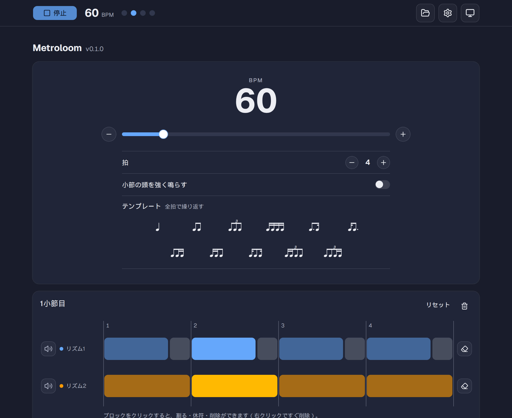
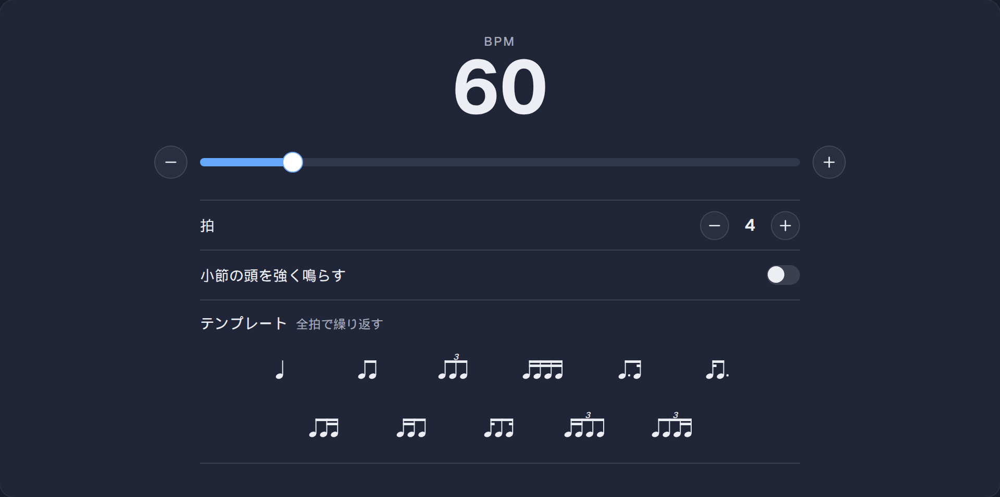
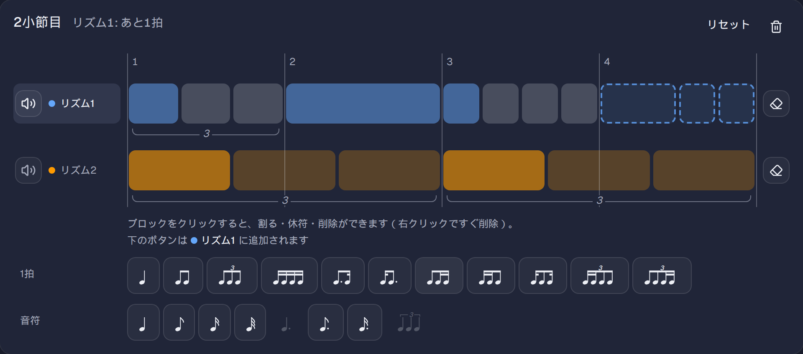
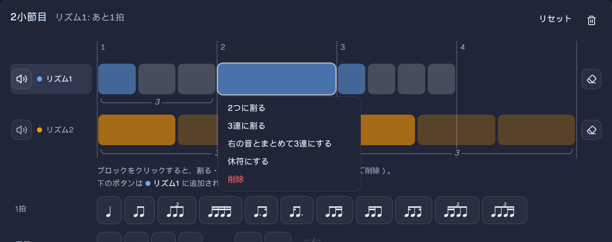
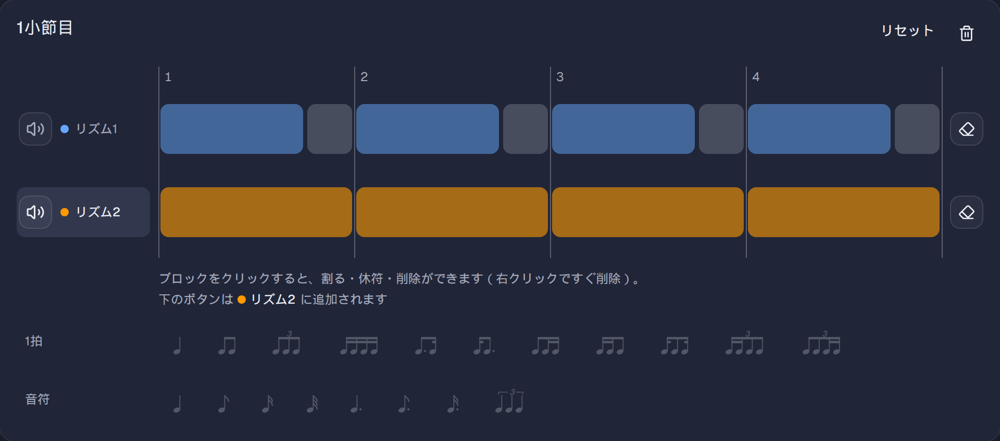
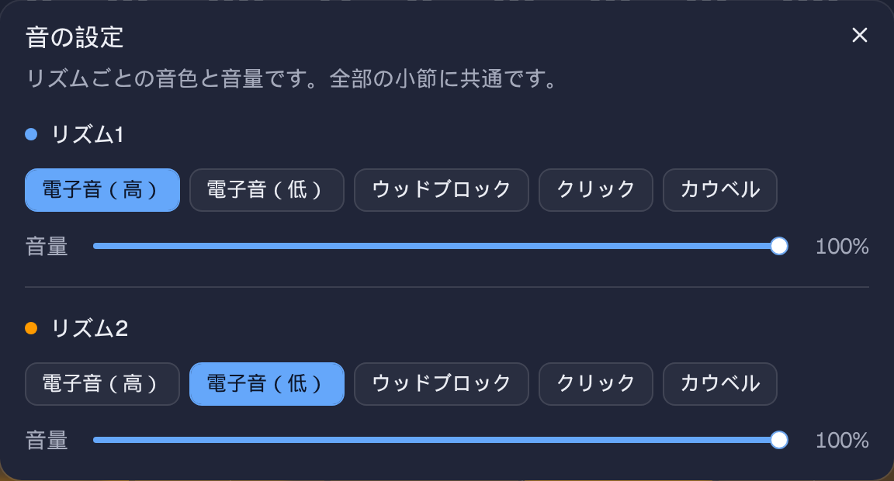
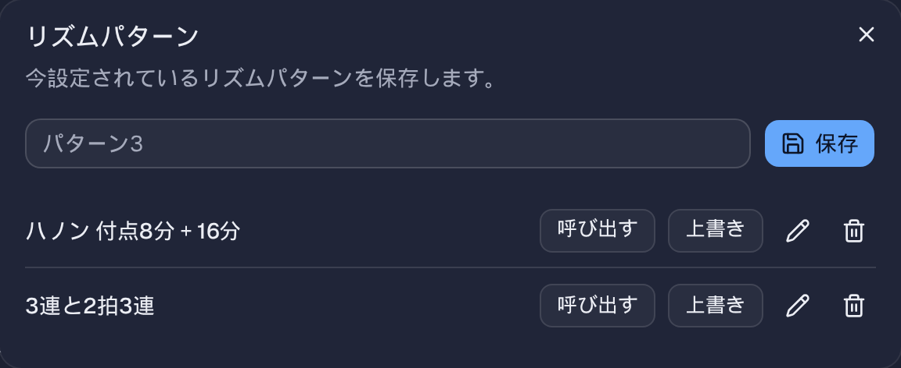
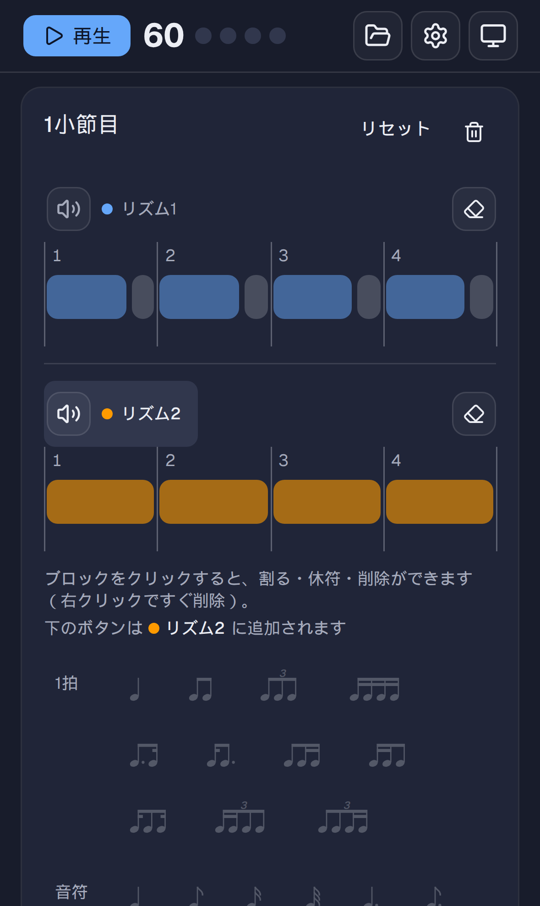

# Metroloom

自分で組んだリズムを鳴らせる、ブラウザで動くメトロノームです。

付点・3連・16分などを組み合わせた1拍の中のリズムを、小節ごとに組み立てられます。
2つのリズムを同時に鳴らすこともできるので、ハノンのリズム変奏や、ポリリズム、2拍3連の練習などに使えます。



## できること

- 1拍のリズムを全拍で繰り返すテンプレート（4分、8分、3連、16分、付点8分＋16分 など）
- 小節ごとに違うリズムを並べる
- 拍をまたぐ連符（2拍3連など）
- リズム1・リズム2の2段を同時に鳴らすポリリズム
- 音符を2つに割る、3連に割る
- 作ったリズムパターンの保存と呼び出し
- 音色と音量の調整
- スマホにも対応

## 使い方

### 1. テンポと拍を決める



- **BPM**：スライダーか、両側の − / ＋ で決めます。
- **拍**：1小節の拍数です。4分音符が1拍です。
- **小節の頭を強く鳴らす**：オンにすると、小節の1拍目だけ強い音で鳴ります。
- **テンプレート**：押すと、そのリズムを全拍で繰り返した1小節になります。

### 2. 再生する

画面の上端にある「再生」を押します。スペースキーでも再生・停止できます。

上端の帯はスクロールしても表示されたままなので、どこを見ていても再生・停止できます。今鳴っている拍は、帯の丸と、小節の中のブロックの色で分かります。

### 3. 小節ごとにリズムを組む



- 「1拍」「音符」のボタンを押すと、その音符が段の末尾に追加されます。
- ボタンにマウスを乗せると、置かれる位置が点線で表示されます。
- 小節に入りきらない音符のボタンは押せなくなります。
- 「小節を追加」で小節を増やせます。小節は上から順に鳴り、最後まで行くと最初に戻ります。

ブロックの横幅は音の長さを表しています。縦線と数字は拍の位置です。

### 4. ブロックを割る・休符にする



ブロックをクリックすると、メニューが開きます。

- **2つに割る**：同じ長さの2つの音にします（4分 → 8分×2）。
- **3連に割る**：その長さの中の3連にします（4分 → 8分の3連、16分 → 32分の3連）。
- **右の音とまとめて3連にする**：右隣の音と合わせた長さを、3つの同じ長さの音にします。
- **休符にする**：その音を休符にします。
- **削除**：その音を消します。3連の中の音なら、3連ごと消えます。

PC では、ブロックを右クリックしてもすぐに削除できます。

### 5. リズム2で別のリズムを重ねる



小節には、リズム1とリズム2の2段があり、同時に鳴ります。初期設定では、リズム2はリズム1より少し低い音で鳴ります。

- **追加先の切り替え**：「リズム1」「リズム2」のラベルか段をクリックすると、音符ボタンの追加先が切り替わります。
- **ミュート**：スピーカーのボタンで、その小節のその段を鳴らさないようにできます。
- **段を空にする**：消しゴムのボタンで、その段の音符を全部消します。
- **リセット**：小節の右上の「リセット」で、リズム1・2とも空にします。

### 音色と音量



画面上端の歯車から開きます。リズム1・2ごとに、音色（電子音・ウッドブロック・クリック・カウベル）と音量を選べます。音色のボタンを押すと、その音を試しに1回鳴らします。

### リズムパターンの保存・呼び出し



画面上端のフォルダのボタンから開きます。名前を付けて「保存」すると、今のリズムパターンが保存されます。拍数・小節・BPM・ミュート・小節の頭の強さも一緒に保存されます。

保存したものは「呼び出す」で元に戻せます。「上書き」で今のリズムパターンに置き換えたり、名前を変えたり、削除したりもできます。

### スマホ



スマホでは、ラベルと段が縦に並びます。ブロックをタップするとメニューが開きます。

## 保存されるデータについて

音色・音量と、保存したリズムパターンは、使っているブラウザの中（localStorage）にだけ保存されます。
そのため、別のブラウザや別の端末とは共有されません。

## 開発

```bash
pnpm install
pnpm dev     # 開発サーバー
pnpm build   # ビルド（dist に出力）
pnpm lint
```
